# 喵星说明书 - 用户流程图

> 版本: v1.0 | 更新日期: 2026-02-12

---

## 1. 全局导航架构

### 1.1 Tab 导航结构

```
┌─────────────────────────────────────────────────┐
│                  喵星说明书 App                    │
├────────────┬────────────┬───────────┬────────────┤
│   🏠 首页   │  📋 档案   │  🏆 排行   │  👤 我的   │
│  (Tab 1)   │  (Tab 2)  │  (Tab 3)  │  (Tab 4)  │
└────────────┴────────────┴───────────┴────────────┘
```

### 1.2 页面层级关系

```
Level 0 (TabBar)          Level 1 (子页面)           Level 2 (结果页)
─────────────────         ──────────────────         ──────────────────
首页 ─────────────────┬── AI喵相学 ──────────────── 喵相诊断单(结果)
│ · 每日猫历卡片       │
│ · 4功能入口          ├── CBTI测试 ─────────────── 喵星说明书(结果)
│ · 更多玩法区         │
│                     ├── 喵语听力统考 ──────────── 听觉雷达图结果
│                     │
│                     ├── 爪速大挑战 ────────────── 爪速结算页(内嵌)
│                     │
│                     └── 双猫匹配 ─────────────── 匹配结果(内嵌)

档案 ─────────────────── (无子页面，直接展示猫咪档案+测试记录)

排行 ─────────────────┬── 手速榜 (默认)
                      └── 颜值榜

我的 ─────────────────── (无子页面，用户中心+设置)
```

### 1.3 页面跳转关系图 (Mermaid)

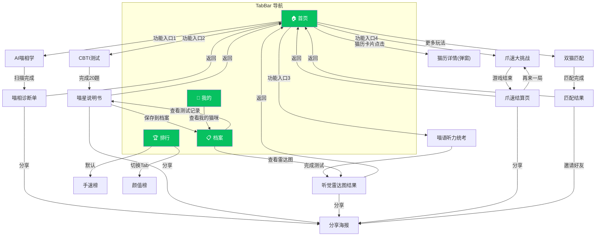

---

## 2. 核心用户旅程

### 2.1 三阶段用户路径

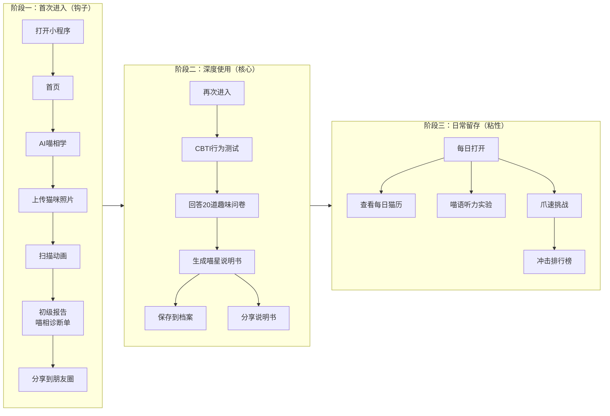

### 2.2 新用户首次体验流程 (First-Time User Experience)

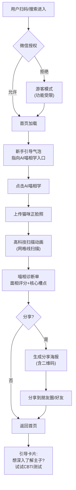

---

## 3. 各功能模块详细流程

### 3.1 AI喵相学

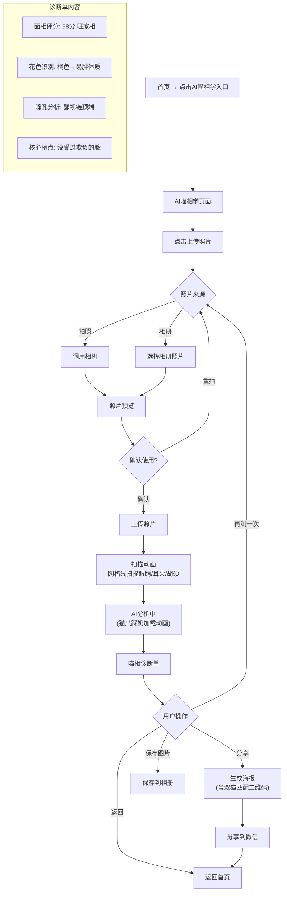

### 3.2 CBTI 深度性格测试

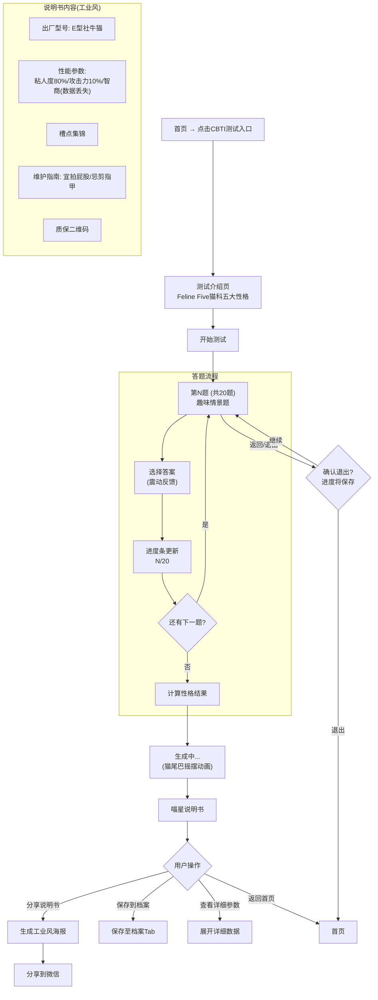

### 3.3 喵语听力统考

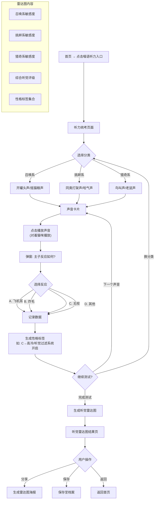

### 3.4 爪速大挑战

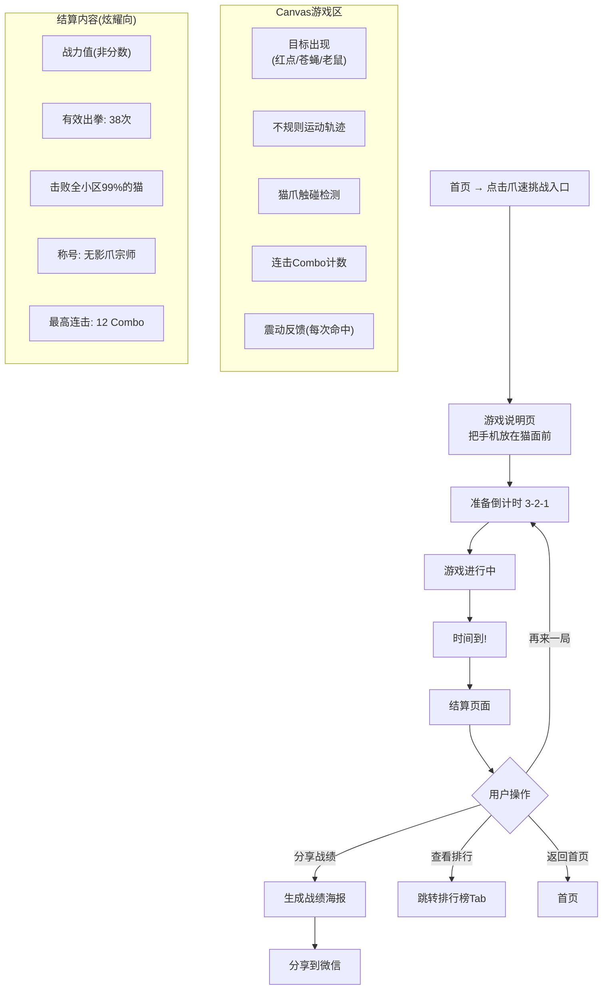

### 3.5 双猫匹配

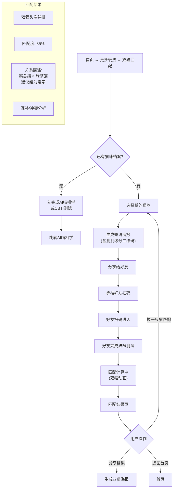

### 3.6 每日猫历

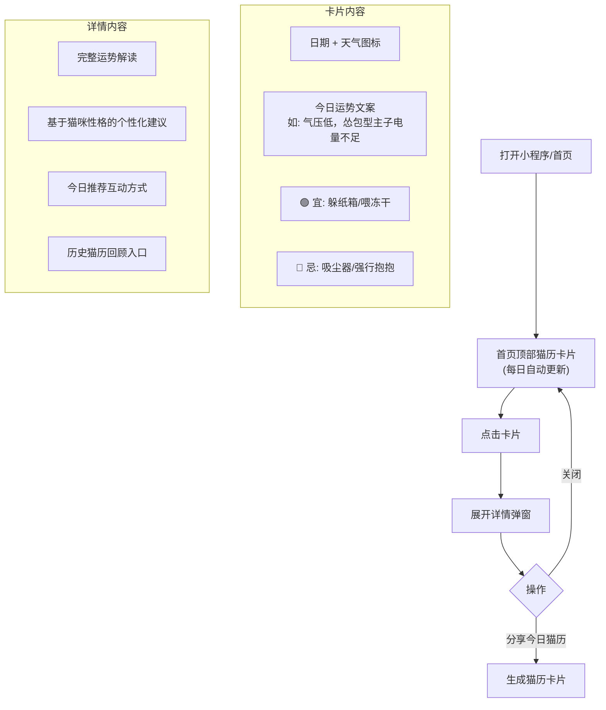

### 3.7 排行榜

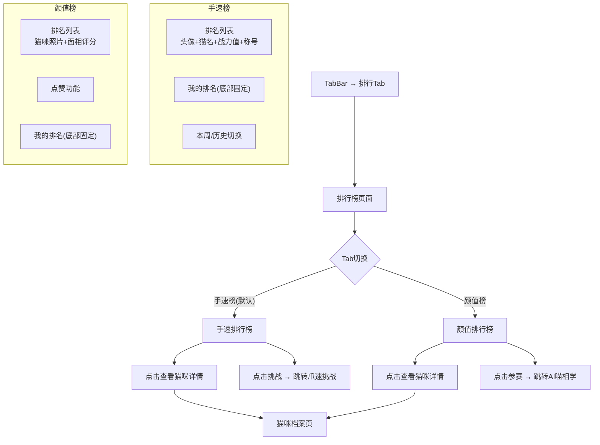

---

## 4. 社交裂变流程

### 4.1 分享海报生成通用流程

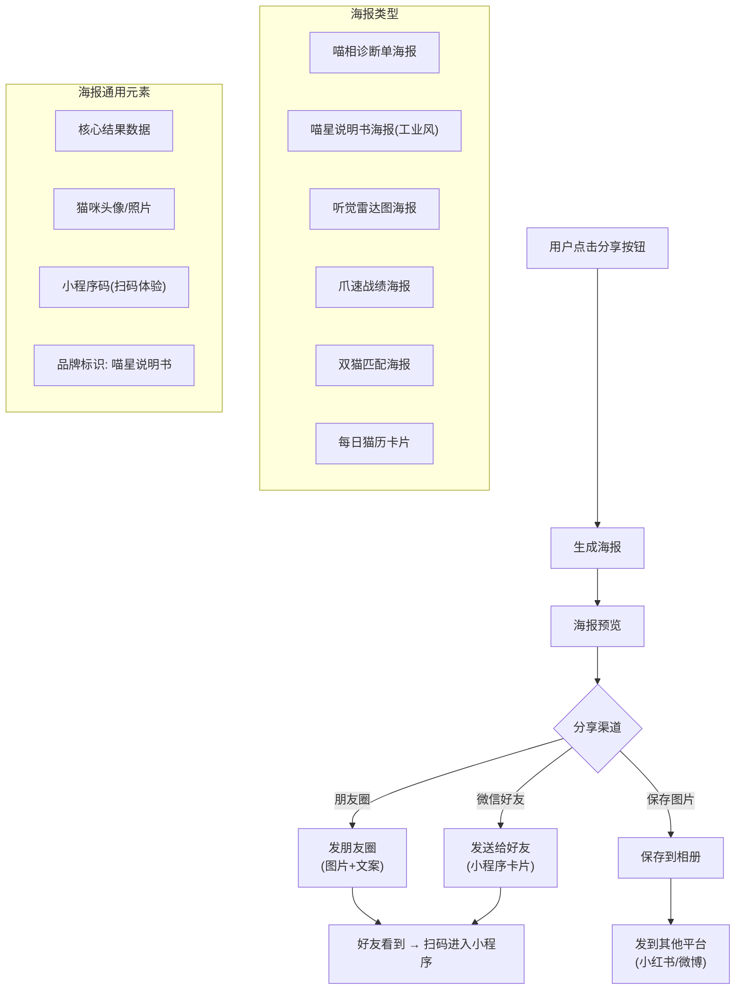

### 4.2 双猫匹配邀请流程

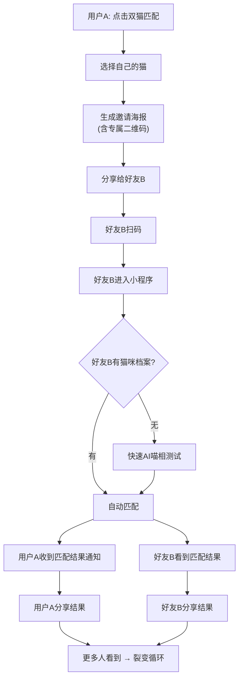

### 4.3 排行榜炫耀流程

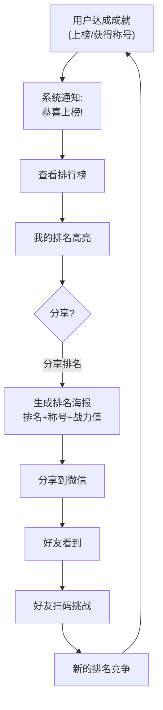

---

## 5. 页面状态矩阵

### 5.1 状态定义

| 状态 | 说明 | 视觉表现 |
|------|------|----------|
| 默认态 | 正常展示 | 完整内容 |
| 加载态 | 数据加载中 | 猫爪踩奶/猫尾摇摆动画 |
| 空态 | 无数据 | 插画+引导文案 |
| 错误态 | 请求失败 | 错误提示+重试按钮 |
| 完成态 | 操作完成 | 成功反馈+下一步引导 |
| 进行态 | 操作进行中 | 进度指示 |
| 锁定态 | 功能未解锁 | 灰色遮罩+解锁条件 |

### 5.2 各页面状态矩阵

| 页面 | 默认态 | 加载态 | 空态 | 错误态 | 完成态 | 进行态 | 锁定态 |
|------|--------|--------|------|--------|--------|--------|--------|
| 首页 | 完整展示所有模块 | 首次加载骨架屏 | - | 网络错误提示 | - | - | - |
| 每日猫历 | 今日运势卡片 | 天气数据加载中 | 未完成测试→引导测试 | 天气获取失败→通用运势 | - | - | - |
| AI喵相学 | 上传入口 | 照片上传中 | - | 上传失败→重试 | 诊断单生成 | 扫描动画进行中 | - |
| CBTI测试 | 介绍页 | - | - | - | 说明书生成 | 答题进行中(N/20) | - |
| 喵星说明书 | 完整说明书 | 结果生成中 | - | 生成失败→重试 | 已保存到档案 | - | - |
| 喵语听力 | 分类选择 | 声音加载中 | - | 声音播放失败 | 雷达图生成 | 测试进行中 | - |
| 听觉雷达图 | 完整雷达图 | 数据计算中 | - | - | 已保存 | - | - |
| 爪速挑战 | 游戏说明 | 资源加载中 | - | - | 结算页展示 | 游戏进行中 | - |
| 双猫匹配 | 选择猫咪 | 匹配计算中 | 无猫咪档案→引导测试 | 匹配失败 | 匹配结果 | 等待好友扫码 | - |
| 档案 | 猫咪列表+记录 | 数据加载中 | 无猫咪→引导添加 | 加载失败 | - | - | - |
| 排行-手速榜 | 排名列表 | 数据加载中 | 本周无数据 | 加载失败 | - | - | 未生成说明书→不可上榜 |
| 颜值榜 | 排名列表 | 数据加载中 | 本周无数据 | 加载失败 | - | - | 未生成说明书→不可上榜 |
| 我的 | 用户信息+设置 | 数据加载中 | 未登录→引导授权 | 加载失败 | - | - | - |

### 5.3 关键状态流转

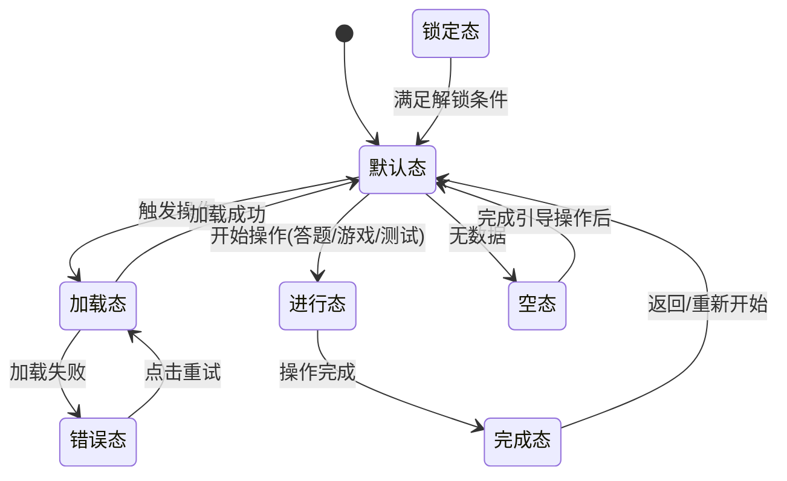

---

## 6. 异常与边界流程

### 6.1 网络异常处理

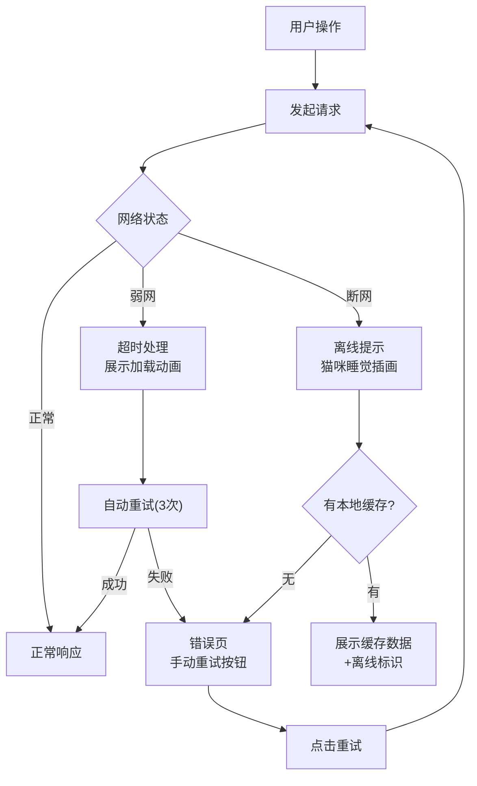

### 6.2 权限拒绝处理

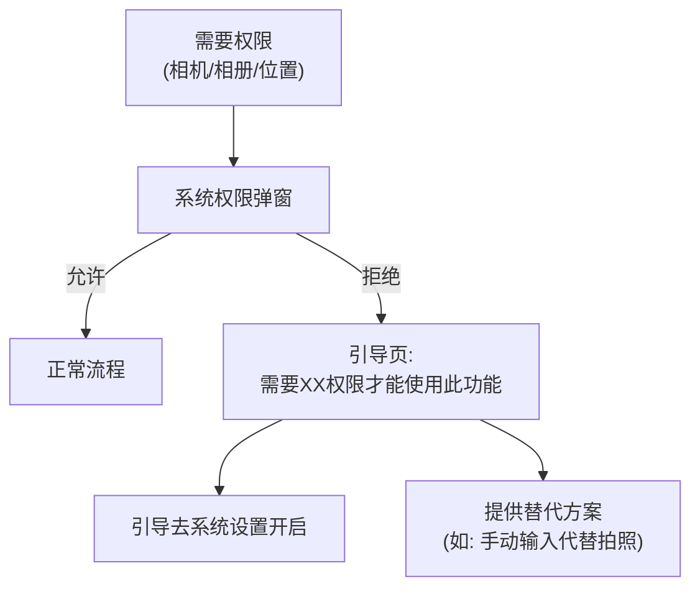

---

*文档版本: v1.0 | 基于 PRD v1.0 | 页面清单: 13个页面*


